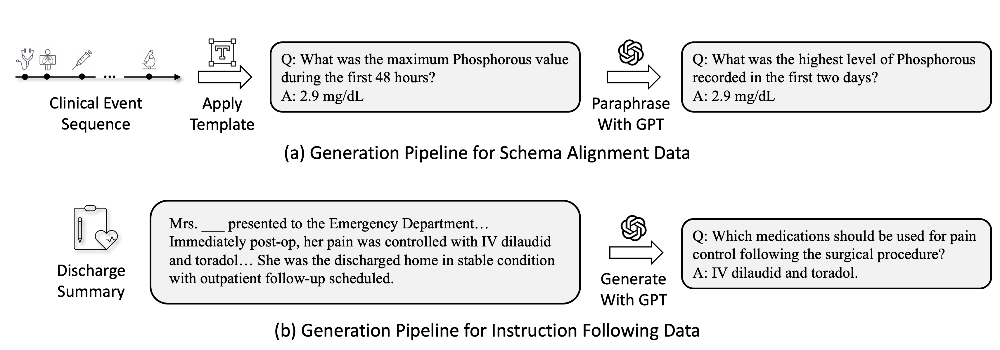
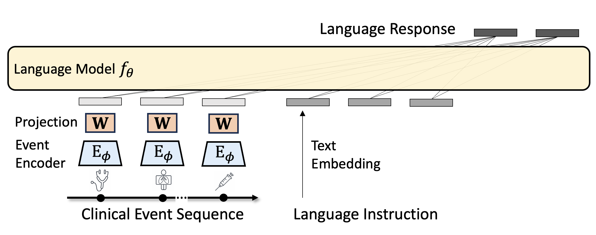

<p align="center">
    
</p>


# Instruction Tuning Large Language Models to Understand Electronic Health Records

**Authors:** Zhenbang Wu, Anant Dadu, Michael Nalls, Faraz Faghri, Jimeng Sun  

**Published at:** NeurIPS 2024 Datasets and Benchmarks Track (Spotlight)

[[📑Paper](https://openreview.net/pdf?id=Dgy5WVgPd2)] [[🪧Poster](./poster.pdf)] [[📽️Slides](./slides.pdf)]


## Release
- [9 Sep 2025] The full dataset is released on PhysioNet. Thanks everyone for the patiene!
- [19 Dec 2024] The trained model weights are released
- [11 Dec 2024] A sample dataset with ~100 patients is added
- [11 Dec 2024] Code for dataset creation, model training, and response evaluation is released


## Contents
- [Core Dependencies](#core-dependencies)
- [Data Download](#data-download)
- [Model Download](#model-download)
- [Evaluate](#evaluate)
- [Train](#train)
- [Dataset Creation](#dataset-creation)
- [Notes on Model Enhancements](#notes-on-model-enhancements)
- [Citation](#citation)


## Core Dependencies
```
python 3.9
torch 2.3.0
transformers 4.44.0
peft 0.10.0
```


## Data Download

<p align="center">
    
</p>

The **MIMIC-Instr** dataset is hosted on [PhysioNet](https://physionet.org/content/mimic-iv-ext-instr/1.0.0/). A sample dataset generated from the [MIMIC-IV Demo](https://physionet.org/content/mimic-iv-demo/2.2/) database is available in the `sample_data` directory. Please feel free to contact Zhenbang Wu at zw12@illinois.edu if you have any questions.


## Model Download

<p align="center">
    
</p>

The pre-trained model checkpoints can be found on the Hugging Face model hub: [zzachw12/llemr-v1](https://huggingface.co/zzachw12/llemr-v1).

You can load the model using the following code snippet:

```python
from peft import PeftModel
from src.model.init_llemr import init_llemr

# Define paths for the base model and LoRA weights
llm_pretrained_model_name_or_path = "lmsys/vicuna-7b-v1.5"
lora_name_or_path = "zzachw12/llemr-v1"

# Initialize the base model and tokenizer
model, tokenizer = init_llemr(llm_pretrained_model_name_or_path, hidden_size=1027)

# Integrate the LoRA weights into the model
model = PeftModel.from_pretrained(model, lora_name_or_path)
```

**Note:** This model requires pre-computed event embeddings generated by BiomedBERT. Follow [Evaluate](#evaluate) to preprocess the data, generate the response, and evaluate the model.


## Evaluate

1. Download the MIMIC-Instr dataset from PhysioNet

2. Run steps 1, 4, 7, 8 in [Data Generation](#data-generation) to prepare the event sequence data and pre-compute the event embeddings

3. Generate the model response with [query_llemr.ipynb](src/eval/query_llemr.ipynb)

4. Compare the model response with the GPT-4 reference answer with [eval.ipynb](src/eval/eval.ipynb) (need OpenAI Azure service)

5. Summarize the results with [summary_eval.ipynb](src/eval/summary_eval.ipynb)


## Train

1. Download the MIMIC-Instr dataset from PhysioNet

2. Run steps 1, 4, 7, 8 in [Data Generation](#data-generation) to prepare the event sequence data and pre-compute the event embeddings

3. Run the training script [train.py](src/train/train.py):
   - CMD: `sh src/train/train.sh`

   
## Dataset Creation

1. Download the [MIMIC-IV](https://physionet.org/content/mimiciv/2.2/) in the `raw_data` directory

2. Download the [MIMIC-IV-Note](https://physionet.org/content/mimic-iv-note/2.2/) dataset in the `raw_data` directory

3. Run the following jupyter notebook to select the patient cohort: [01_cohort_selection.ipynb](src/preprocess/01_cohort_selection.ipynb)

4. Run the following jupyter notebooks to prepare the event sequence data:
   - 1. Extract events:
     - [02_event_static.ipynb](src/preprocess/02_event_static.ipynb) 
     - [02_event_hosp_diagnoses_icd.ipynb](src/preprocess/02_event_hosp_diagnoses_icd.ipynb)
     - [02_event_hosp_labevents.ipynb](src/preprocess/02_event_hosp_labevents.ipynb)
     - [02_event_hosp_microbiologyevents.ipynb](src/preprocess/02_event_hosp_microbiologyevents.ipynb)
     - [02_event_hosp_prescriptions.ipynb](src/preprocess/02_event_hosp_prescriptions.ipynb)
     - [02_event_hosp_transfers.ipynb](src/preprocess/02_event_hosp_transfers.ipynb)
     - [02_event_icu_chartevents.ipynb](src/preprocess/02_event_icu_chartevents.ipynb)
     - [02_event_icu_inputevents.ipynb](src/preprocess/02_event_icu_inputevents.ipynb)
     - [02_event_icu_outputevents.ipynb](src/preprocess/02_event_icu_outputevents.ipynb)
     - [02_event_icu_procedureevents.ipynb](src/preprocess/02_event_icu_procedureevents.ipynb)
   - 2. Merge events: [03_merge_events.ipynb](src/preprocess/03_merge_events.ipynb)

5. Run the following jupyter notebooks to generate the instruction tuning data:
   - Run this only if you want to generate the instruction tuning data on your own 
   - 1. Generate the schema alignment subset:
     - [04_template_qa_event.ipynb](src/preprocess/04_template_qa_event.ipynb)
     - [04_paraphrase_qa_event.ipynb](src/preprocess/04_paraphrase_qa_event.ipynb) (need OpenAI Azure service)
   - 2. Generate the instruction following subset:
     - [04_generate_qa_note.ipynb](src/preprocess/04_generate_qa_note.ipynb) (need OpenAI Azure service)

6. Split the data into train, validation, and test sets:
   - [05_data_split.ipynb](src/preprocess/05_data_split.ipynb)

7. Pre-compute the event embeddings with [06_precompute_event_embeddings.py](src/preprocess/06_precompute_event_embeddings.py):
    - CMD: `sh src/preprocess/precompute_event_embeddings.sh`

8. Generate the GPT-4 reference answer with [query_gpt4.ipynb](src/eval/query_gpt4.ipynb)


## Notes on Model Enhancements

This repository incorporates several minor improvements over the original implementation described in the paper:

1. **Enhanced Event Encoder:**
   - Replaced ClinicalBERT (`emilyalsentzer/Bio_ClinicalBERT`) with BiomedBERT-large (`microsoft/BiomedNLP-BiomedBERT-large-uncased-abstract`), improving the quality of event embeddings

2. **Improved Event Embedding:**
   - Concatenated event timestamps and numeric values (where available) to the final event embeddings, resulting in better representation of time-sensitive and quantitative data

3. **Expanded Dataset:**
   - Increased the size of the clinical reasoning subset to 100K examples, doubling the data from the original 50K subset for more comprehensive coverage.

4. **Unified Training Approach:**
   - Adopted a single-step training process that integrates schema alignment and clinical reasoning subsets simultaneously, streamlining the training pipeline

These advancements collectively enhance the model's ability to interpret and reason with EHR data, delivering superior performance compared to its predecessor.


## Citation

If you find this work useful, please cite:
```
@inproceedings{
    wu2024instruction,
    title={Instruction Tuning Large Language Models to Understand Electronic Health Records},
    author={Zhenbang Wu and Anant Dadu and Michael Nalls and Faraz Faghri and Jimeng Sun},
    booktitle={The Thirty-eight Conference on Neural Information Processing Systems Datasets and Benchmarks Track},
    year={2024},
    url={https://openreview.net/forum?id=Dgy5WVgPd2}
}
```

\* Note: The teaser image above the title is generated by ChatGPT.
